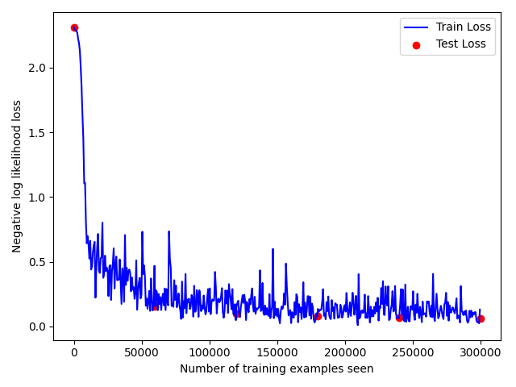

# Project 5: Recognition using Deep Networks

**CS5330 Pattern Recognition & Computer Vision**

## Team

- Parker Cai — [@parkercai](https://github.com/ParkerCai)
- Jenny Nguyen — [@jennyncodes](https://github.com/jennyncodes)

## Overview

This project is about learning how to build, train, analyze, and modify a deep network for a recognition task.

## Project Description

Build, train, and analyze deep networks for digit and symbol recognition using the MNIST dataset and PyTorch. Includes a CNN classifier, transfer learning for Greek letters, a transformer-based variant, and architecture experiments.

## CNN Architecture


## Training Curves



## Setup

Requires Python 3.13+.

```bash
pip install torch torchvision matplotlib opencv-python
```

MNIST data downloads automatically into `data/` on first run.

## Scripts

| Script             | Task | Description                                                   |
| ------------------ | ---- | ------------------------------------------------------------- |
| `train.py`       | 1    | Build CNN, train on MNIST, save model                         |
| `evaluate.py`    | 1    | Load saved model, evaluate on test set and handwritten digits |
| `analyze.py`     | 2    | Visualize first-layer filters and their effect on images      |
| `greek.py`       | 3    | Transfer learning for Greek letter recognition                |
| `transformer.py` | 4    | Transformer-based MNIST classifier                            |
| `experiment.py`  | 5    | Automated architecture search over multiple dimensions        |

## Usage

Run scripts from the project root:

```bash
python train.py
python evaluate.py
python analyze.py
python greek.py
python transformer.py
python experiment.py
```

## Project Structure

```
├── train.py
├── evaluate.py
├── analyze.py
├── greek.py
├── transformer.py
├── experiment.py
├── data/                  ← MNIST (auto-downloaded)
├── results/               ← saved models, plots
├── greek_letters/         ← Greek letter training images
│   ├── alpha/
│   ├── beta/
│   └── gamma/
├── handwritten_digits/    ← handwritten digit images
└── docs/
    └── project5-spec.md
```
