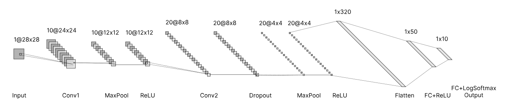
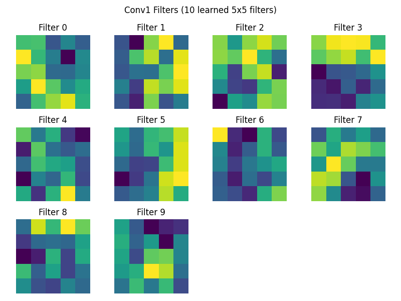
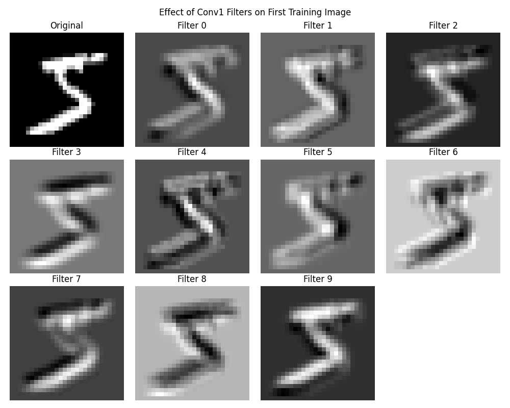
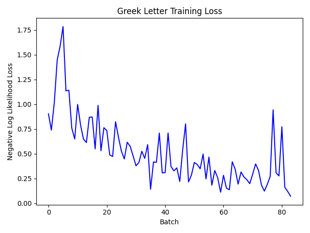
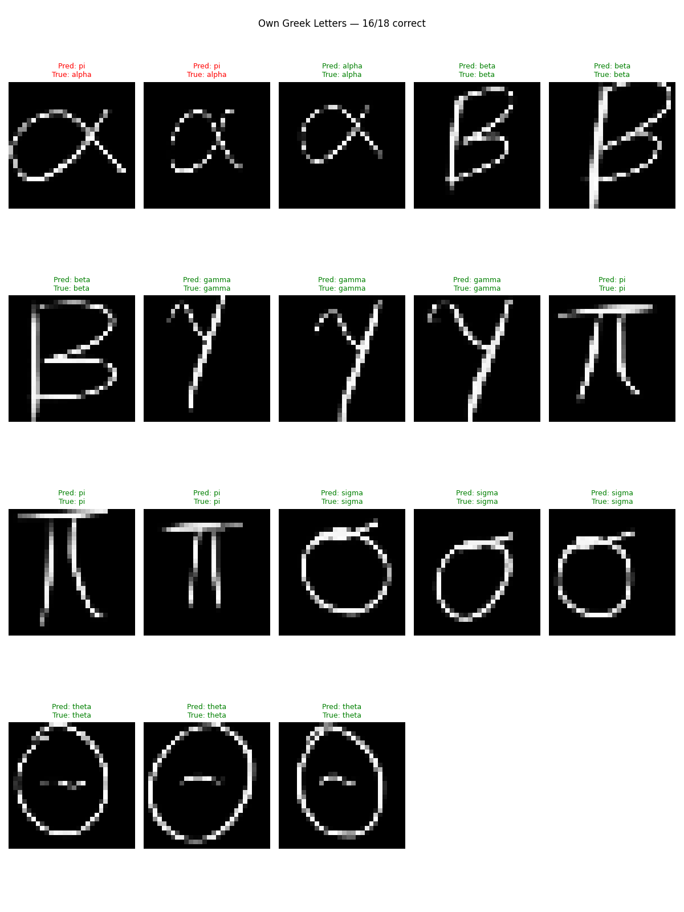
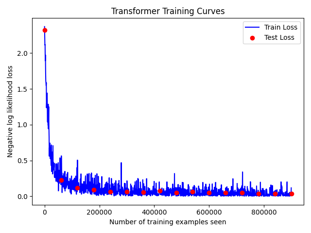
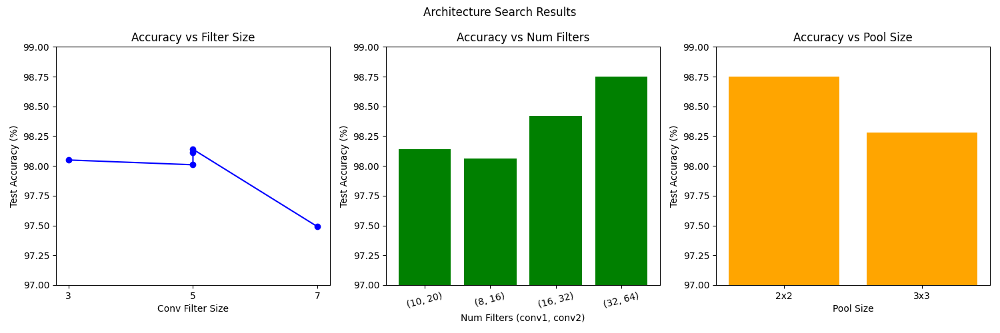
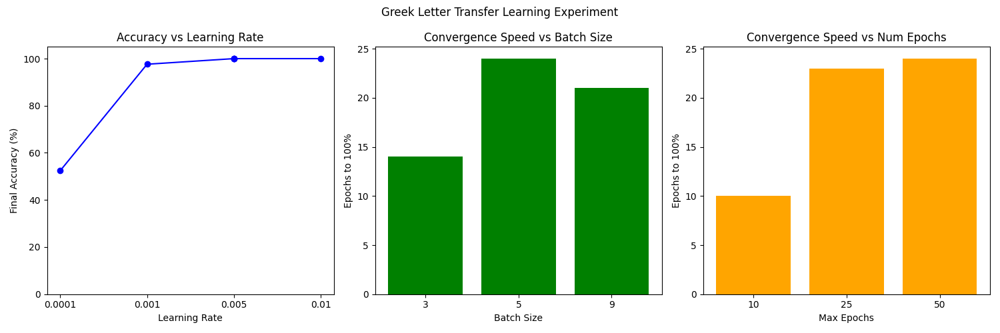
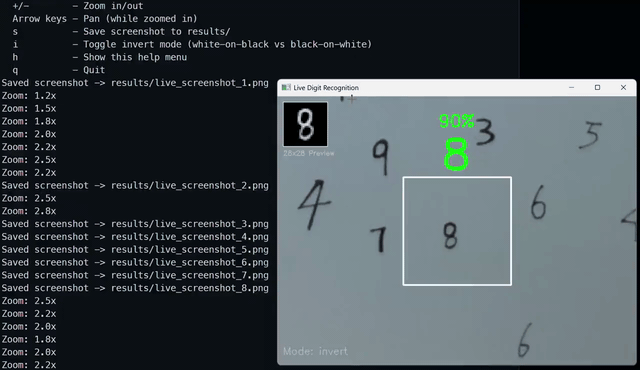
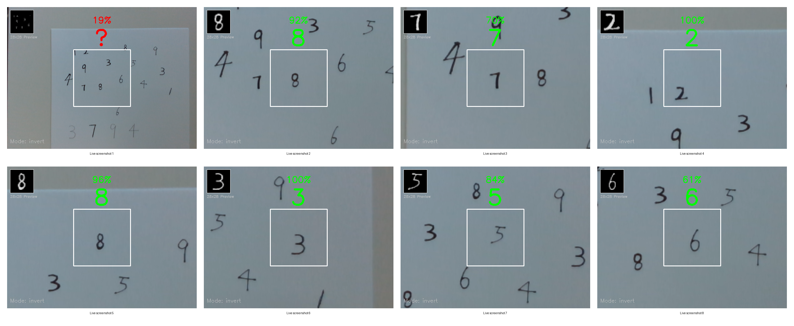

# Project 5: Recognition using Deep Networks

**CS5330 Pattern Recognition & Computer Vision**

## Team

- Parker Cai — [@parkercai](https://github.com/ParkerCai)
- Jenny Nguyen — [@jennyncodes](https://github.com/jennyncodes)

## Overview

This project is about learning how to build, train, analyze, and modify a deep network for a recognition task.

## Project Description

Build, train, and analyze deep networks for digit and symbol recognition using the MNIST dataset and PyTorch. Includes a CNN classifier, transfer learning for Greek letters, a transformer-based variant, and architecture experiments.

## CNN Architecture



## Training Curves


## Conv1 Filters and Effects




## Greek Letter Transfer Learning (Task 3)




Handwritten Greek letter training data: https://drive.google.com/drive/folders/1FaYHNvMobunlO5ii88R0_tRXaNvm0Cpw?usp=drive_link

## Transformer Training Curves (Task 4)



## Experiment Results (Task 5)



## Greek Letter Experiment (Extension)



## Live Digit Recognition (Extension)





## Setup

Requires Python 3.13+.

```bash
pip install torch torchvision matplotlib opencv-python
```

MNIST data downloads automatically into `data/` on first run.

## Scripts

| Script                  | Task | Description                                                   |
| ----------------------- | ---- | ------------------------------------------------------------- |
| `train.py`            | 1    | Build CNN, train on MNIST, save model                         |
| `evaluate.py`         | 1    | Load saved model, evaluate on test set and handwritten digits |
| `analyze.py`          | 2    | Visualize first-layer filters and their effect on images      |
| `greek.py`            | 3    | Transfer learning for Greek letter recognition                |
| `transformer.py`      | 4    | Transformer-based MNIST classifier                            |
| `experiment.py`       | 5    | Automated architecture search over multiple dimensions        |
| `greek_experiment.py` | EXT  | Experiment with greek letter transfer learning                |
| `live_digit.py`       | EXT  | Live webcam digit recognition with CNN inference              |

## Usage

Run scripts from the project root:

```bash
python train.py
python evaluate.py
python analyze.py
python greek.py
python transformer.py
python experiment.py
python greek_experiment.py
python live_digit.py
```

## Project Structure

```
├── train.py
├── evaluate.py
├── analyze.py
├── greek.py
├── transformer.py
├── experiment.py
├── greek_experiment.py
├── live_digit.py
├── utils/                            ← Helper Functions
│   ├── plot.py                       ← Plotting utilities
│   └── NetTransformer-template.py    ← Transformer template
├── data/                  ← MNIST (auto-downloaded)
├── results/               ← saved models, plots
├── greek_train/         ← Greek letter training images
│   ├── alpha/
│   ├── beta/
│   └── gamma/
│   └── pi/                ← Greek letter training images for extensions
│   └── sigma/
│   └── theta/
├── handwritten_digits/    ← handwritten digit images
├── handwritten_greeks/    ← handwritten greek letter images
└── docs/
    └── project5-spec.md
```
